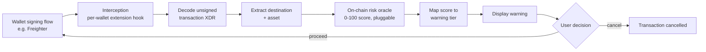

# Gryd Lock — Research 🔒

Design study for **Gryd Lock**, a pre-transaction warning system for Stellar — the threat model,
literature review, system design, and evaluation methodology behind the product.

**No code.** This repo is the reasoning that the rest of the org is built on. If you want to
understand *why* Gryd Lock is shaped the way it is, start here.

## Overview

Stellar transactions are irreversible once submitted, so a fraud tool cannot intervene after the
fact — the only protective window is before the user signs. This study designs a pre-transaction
warning system that intercepts the signing flow, requests an on-chain risk score for the
destination, and surfaces a tiered warning the user can act on. It adapts the pre-signing scanner
pattern established on other ecosystems to Stellar's specific constraints, and defines how the
resulting tool will be measured.

### The Problem

Ordinary users cannot distinguish a safe destination from a fraudulent one at signing time.
Wash-trading schemes, scam tokens, and social-engineering attacks all appear as ordinary
transactions in the wallet UI. Because settlement is final, a user who signs a malicious
transaction has no recourse.

Pre-signing scanners have worked on other chains — Blowfish, Pocket Universe, and Fire intercept
the Ethereum signing flow, classify the pending transaction, and warn before approval. The
**concept** transfers to Stellar. The **mechanism** does not: Ethereum exposes a single universal
injected provider that one tool can wrap, whereas Stellar wallets each expose their own signing
API. This is the central technical finding that shapes the whole design.

### What This Study Does

At a high level, it does three things:

- **🔎 Diagnoses** — identifies why the Ethereum pre-signing scanner pattern cannot be ported to
  Stellar as-is, and isolates the per-wallet signing API as the specific blocker
- **🧩 Designs** — proposes an interception → decode → score → warn pipeline built around a
  pluggable, on-chain risk oracle, with a per-wallet interception strategy starting with Freighter
- **📏 Defines evaluation** — specifies the latency, accuracy, false-positive, and comprehension
  metrics the eventual implementation must be measured against before it can be trusted

## Threat Model

- **In scope:** malicious destination addresses, scam / wash-traded assets, and social-engineering
  flows that trick a user into signing a transfer to an attacker-controlled destination.
- **Out of scope:** compromised wallets, malware that signs without user interaction, and
  chain-level attacks. Gryd Lock protects the *signing decision*; it cannot protect a user who has
  already lost control of their keys.
- **Trust assumptions:** the risk intelligence comes from an on-chain oracle, so it is publicly
  auditable and requires no trust in a centralised third party. Gryd Lock trusts the oracle's score
  but never blocks on it — the user always makes the final call.

## System Design

Interception happens per-wallet (Freighter first), since Stellar has no universal injected
provider equivalent to Ethereum's. The scoring engine sits behind an adapter interface and is
treated as a black box by this study — the design deliberately does not depend on how any
particular oracle computes its score.

### Warning Tiers

| Score  | Tier     | Behaviour                                |
| ------ | -------- | ----------------------------------------- |
| 0–20   | Low      | Proceed                                  |
| 21–50  | Elevated | Soft warning                             |
| 51–75  | High     | Strong warning, require confirm          |
| 76–100 | Critical | Recommend abort                          |

## Research Questions

1. Can an on-chain risk score be queried fast enough to warn a user before they sign, without
   adding friction that pushes them to disable the tool?
2. Which destination- and asset-level signals indicate fraud reliably enough to justify a warning,
   without a false-positive rate that trains users to ignore it?
3. How should a pre-signing warning be designed so a non-expert user understands the risk and acts
   on it, rather than clicking through?

## Methodology

1. **Literature review** — pre-signing interception, transaction finality, scanner UX.
2. **System design** — architecture fixed before code, including per-wallet interception.
3. **Build** — extension, oracle adapter, warning UI.
4. **Testing** — labelled destinations on testnet; measure latency, accuracy, false-positive rate.
5. **Evaluation** — user comprehension and real protective value.

## Evaluation Plan

| Metric                | What it measures                                                        |
| ---------------------- | ------------------------------------------------------------------------ |
| **Latency**            | Time from signing intent to displayed warning; must feel instant       |
| **Accuracy**           | Correct tier against labelled scam / wash-trading destinations on testnet |
| **False-positive rate** | The metric that decides whether users keep the tool enabled            |
| **Comprehension**      | Whether non-experts correctly read and act on each tier                |

Fixtures for this live in [`grydlock-testkit`](../grydlock-testkit).

## Roadmap

### Phase 1 — Research _(this repo)_

- [x] Literature review of pre-signing interception, transaction finality, and scanner UX
- [x] Threat model and trust boundaries
- [x] System design: interception → decode → score → warn pipeline
- [x] Evaluation methodology and metrics defined

### Phase 2 — Build

- [ ] Freighter interception hook
- [ ] XDR decode + destination/asset extraction
- [ ] Oracle adapter interface
- [ ] Warning UI (tiered)

### Phase 3 — Testing & Evaluation

- [ ] Labelled scam / wash-trading destination set on testnet
- [ ] Latency, accuracy, and false-positive measurement
- [ ] User comprehension study

## Why This Matters for the Stellar Ecosystem

- **For users** — a tiered warning at the moment of signing turns an irreversible mistake into a
  choice the user actually gets to make
- **For wallets** — a per-wallet interception pattern means Gryd Lock can ship without requiring
  Stellar to adopt a universal injected-provider standard first
- **For the ecosystem** — an open, auditable risk oracle gives any wallet or protocol the same
  pre-signing intelligence, rather than each one building a closed, unverifiable equivalent

## Related Repositories

| Repo                                  | Role                                                              |
| -------------------------------------- | ------------------------------------------------------------------- |
| **`grydlock-research`** _(this repo)_ | Threat model, literature review, system design, evaluation methodology |
| **`grydlock-testkit`**                | Labelled testnet fixtures used to evaluate latency, accuracy, and false-positive rate |

## References

- Stellar Developer Documentation — stellar.org/developers
- Soroban smart contract documentation
- Blowfish and Pocket Universe technical blogs — Ethereum pre-signing scanners
- Baesens, B. — *Fraud Analytics Using Descriptive, Predictive, and Social Network Techniques*
- Benford, F. (1938) — original first-digit law paper
- Krug, S. — *Don't Make Me Think*

---

**Gryd Lock** — the warning before you sign.

_Research for the Stellar ecosystem._

